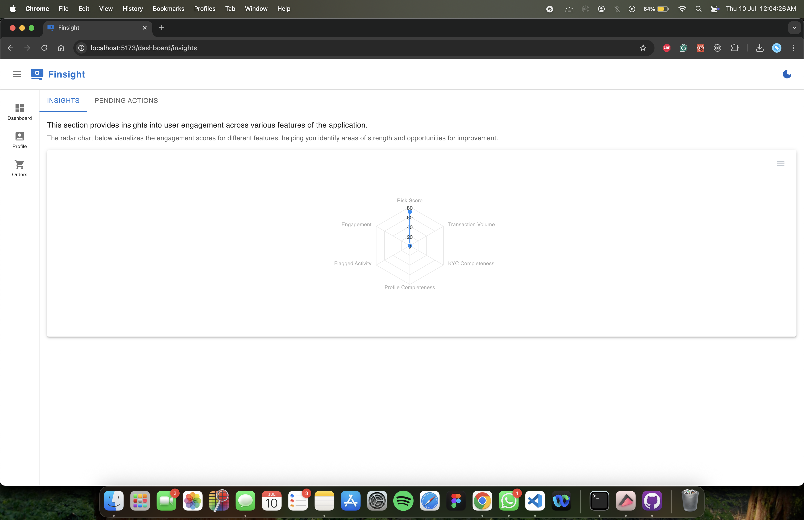

# Finsight Dashboard

**🌐 Prod:** [https://finsight-dashboard.vercel.app](https://finsight-dashboard.vercel.app)

A modern, scalable dashboard application built with React, TypeScript, Material UI, Node.js, and Firebase.


## 📚 Table of Contents

- [Overview](#overview)
- [Key Features](#key-features)
  - [Reusable Table Component](#reusable-table-component)
  - [User Insights Visualization](#user-insights-visualization)
  - [Pending Actions Management](#pending-actions-management)
  - [Modern UI & UX](#modern-ui--ux)
  - [Backend Integration](#backend-integration)
- [Tech Stack](#tech-stack)
- [Key Highlights & Value](#key-highlights--value)
- [Future Enhancements (Open to Suggestions)](#future-enhancements-open-to-suggestions)
- [Contribution & Feedback](#contribution--feedback)
- [Firebase Integration (Database)](#firebase-integration-database)
- [Vercel Deployment (Frontend + Backend)](#vercel-deployment-frontend--backend)
- [Setup local without Vercel](#setup-local-without-vercel)

## Overview

Finsight is a fintech-inspired dashboard application designed to provide insights and actionable data to users in a clear, efficient way. The project highlights a reusable and robust table component with built-in pagination support that works seamlessly across both frontend (React) and backend (Node.js + Firebase) environments.

## Key Features

### Reusable Table Component

- Supports sorting, pagination, and dynamic data loading
- Works with backend pagination APIs in Node.js
- Designed for scalability and easy integration into various pages

### User Insights Visualization

- Radar charts to represent user engagement, risk scores, and activity
- Clear UI for quick comprehension of complex data

### Pending Actions Management

- Interactive tables for actions like KYC verification, compliance review, loan application approvals
- Status indicators with actionable buttons (Approve, Reject, View)

### Modern UI & UX

- Built with Material UI for a clean, responsive design
- Dark mode toggle for better accessibility

### Backend Integration

- Node.js API layer fetching paginated data from Firebase
- Secure, scalable backend architecture

## Tech Stack

- **Frontend:** React, TypeScript, Material UI
- **Backend:** Node.js, Firebase Firestore
- **Hosting:** Vercel
- **Charting:** ApexCharts for data visualization
- **State Management:** React Hooks for reactive UI

## Key Highlights & Value

- Demonstrates expertise in full-stack development with strong TypeScript proficiency
- Showcases ability to create reusable, production-ready components that solve real-world pagination and data loading challenges
- Displays familiarity with modern UI frameworks and data visualization techniques
- Practical experience with API-first development and secure backend data handling

## Future Enhancements (Open to Suggestions)

- Add search/filter functionality
- Implement user authentication and role-based access control
- Enhance charts with more detailed analytics and drill-downs
- Improve responsiveness and accessibility

## Contribution & Feedback

Open to feedback and feature requests! If you want me to add specific features or improvements, please let me know.

## Firebase Integration (Database)

This app uses **Firebase Firestore** as the primary database for storing and retrieving paginated data.

### Setup Firebase

1. Go to [Firebase Console](https://console.firebase.google.com/)
2. Create a new project
3. Enable **Firestore Database**
4. Get your Firebase config (`apiKey`, `projectId`, etc.)
5. Add your Firebase credentials in a `.env` file:

```env
FIREBASE_API_KEY=your_key
FIREBASE_PROJECT_ID=your_project
FIREBASE_CLIENT_EMAIL=your_client_email
FIREBASE_PRIVATE_KEY=your_private_key (make sure to replace \n with actual newlines)
```

6. In your Node.js backend, initialize Firebase like:

```ts
import { initializeApp, cert } from "firebase-admin/app";
import { getFirestore } from "firebase-admin/firestore";

const app = initializeApp({
  credential: cert({
    projectId: process.env.FIREBASE_PROJECT_ID,
    clientEmail: process.env.FIREBASE_CLIENT_EMAIL,
    privateKey: process.env.FIREBASE_PRIVATE_KEY?.replace(/\\n/g, "\n"),
  }),
});

export const db = getFirestore(app);
```

### Vercel Deployment (Frontend + Backend)

#### This project is fully deployable to Vercel.

#### Setup

1. Install Vercel CLI:

```bash
npm i -g vercel
```

2. At the root of your project, configure vercel.json:

```json
{
  "version": 2,
  "builds": [
    {
      "src": "backend/src/lambda.ts",
      "use": "@vercel/node"
    },
    {
      "src": "frontend/package.json",
      "use": "@vercel/static-build",
      "config": { "distDir": "dist" }
    }
  ],
  "routes": [
    {
      "src": "/api/(.*)",
      "dest": "backend/src/lambda.ts"
    },
    {
      "src": "/(.*)",
      "dest": "frontend/$1"
    },
    {
      "handle": "filesystem"
    },
    {
      "src": "/(.*)",
      "dest": "frontend/index.html"
    }
  ]
}
```

3. Deploy with:

```bash
vercel --prod
```

4. Use .env in Vercel Dashboard → Project Settings → Environment Variables

## Setup local without Vercel

---

## 🔁 Backend Setup (Node.js + Express + Firebase Admin)

### ▶️ Run Backend

```bash
cd backend
npm install
npx ts-node src/index.ts
```

This starts the Express server.

## 🧑‍💻 Frontend Setup (React + Vite + TypeScript)

### 🔧 Prerequisites

- Node.js (>= 18)
- NPM

### ▶️ Run Frontend

```bash
cd frontend
npm install
npm run dev
```

### 🌐 Environment Variables

Create a `.env.local` file in the `frontend/` folder:

```
VITE_API_BASE_URL=http://localhost:5050 (node.js API)
```

---

## Firebase Local setup

copy firebase json to `backend/src/firebase/serviceAccountKey.json`

## 🧪 Testing Locally

Run both frontend and backend in separate terminals:

```bash
# Terminal 1
cd frontend && npm run dev

# Terminal 2
cd backend && npx ts-node src/index.ts
```

---
